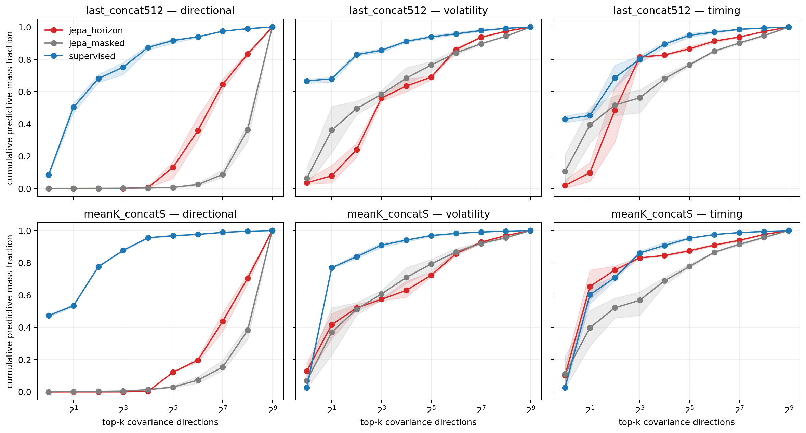

# Predictive information geometry in Limit Order Book representations

This repository studies a question that ordinary downstream accuracy does not
answer: **when two encoders preserve predictive information, do they make that
information equally accessible to a finite-sample reader?**

Experiment 01 compares supervised, horizon-JEPA and masked-JEPA encoders on
Limit Order Book (LOB) sequences. The encoders are frozen and evaluated across
three independent seeds. The central result is not that horizon-JEPA contains
no directional information. Rather, its directional signal is organized in a
geometry that is poorly aligned with leading-variance directions, fragile to
temporal averaging, and more expensive to recover with limited labels.

The repository contains the frozen protocol, implementation, tests, compact
result package and manifests needed to audit that claim. Large datasets,
feature bundles and checkpoints are distributed separately.

For the shortest rigorous account, start with
[What we did and did not establish](docs/research/COSA_ABBIAMO_FATTO_E_COSA_NO.md).
The [supervisor reading guide](docs/review/SUPERVISOR_READING_GUIDE.md) turns
the empirical record into the decisions needed before building the controlled
mathematical model.

## Scientific question

For a history $\mathcal H_t$, a token-preserving encoder produces

$$
G_t=f_\theta(\mathcal H_t)\in\mathbb R^{K\times S\times d},
\qquad Z_t^{(P)}=P(G_t)\in\mathbb R^D,
$$

where $P$ is an explicit readout such as the final token grid or a temporal
mean. The project separates three objects that are often conflated:

$$
\text{predictive content}
\;\neq\;
\text{content preserved by a readout}
\;\neq\;
\text{finite-sample accessibility}.
$$

Predictive content asks what can be decoded from a representation with a rich
reader and large sample. Readout preservation asks what survives the map
$G\mapsto Z^{(P)}$. Accessibility asks how much performance can be recovered
under a declared budget of labels, dimensions, regularization and reader
capacity. In this experiment it is therefore a curve
$A_{P,\mathcal Q,\lambda}(m,n)$, not an intrinsic scalar property of an
encoder.

The working hypothesis was that a predictive latent objective can preserve a
useful variable while allocating it to directions that are statistically
unfavourable to common downstream readers. Experiment 01 tests the observable
consequences of that hypothesis; it does not claim to identify a causal
training mechanism.

### Why representation geometry can matter

If $A$ is invertible, $Z$ and $AZ$ contain the same information for an
unrestricted decoder. Their covariance spectra, leading principal subspaces
and the penalty induced by an isotropic ridge prior can nevertheless be very
different. Consequently, equal predictive content does not imply equal
performance for a dimension-limited or finite-sample reader. The experiment
measures this operational difference rather than treating probe accuracy as a
direct estimate of total information.

### Encoder objectives

- **Supervised:** the encoder and task head are optimized directly against the
  declared future LOB targets.
- **Horizon-JEPA:** a context representation predicts target-encoder latents at
  future positions, without direct optimization against the evaluation target
  blocks.
- **Masked-JEPA:** the predictive objective reconstructs masked latent content
  and acts as a second self-supervised control.

The backbone and token grid are shared to the extent required by the frozen
multiseed protocol; downstream comparisons discard the supervised task head
and operate on encoder representations.

## Experimental design

- **Data:** seven LOB instruments and 8,039,246 ordered endpoints.
- **Encoders:** supervised, horizon-JEPA and masked-JEPA, with seeds 0, 1 and 2.
- **Primary readout:** `last_concat512`, the four token roles at the final time
  position.
- **Secondary readout:** `meanK_concatS`, a temporal mean used to test pooling
  sensitivity.
- **Targets:** directional variables are primary; volatility and timing are
  separate specificity controls. Directional targets include changes in
  spread, microprice and top-level imbalance across multiple horizons.
- **Splits:** complete stock-days, with train, validation and test disjoint by
  canonical identity `(stock_id, trading_date)`.
- **Selection:** hyperparameters are chosen on validation; the fixed test set is
  used only for final evaluation.

The supervised versus horizon-JEPA contrast is primary. Masked-JEPA remains in
the complete inventory as a control, but ceiling-normalized claims are not made
for cells that fail the preregistered eligibility threshold.

The three diagnostic phases answer complementary questions:

| phase | question | intervention |
|---|---|---|
| I | Is the signal more label-expensive to recover? | learning curves, trace-normalized ridge, progressive whitening |
| II | Where is predictive signal located in the covariance spectrum? | predictive mass, PCA ladders, Haar nulls, disjoint spectral bands |
| III-R | Does the gap survive a richer reader and changed conditioning? | preregistered MLP readers in native and whitened coordinates |

## Main findings

1. **The finite-sample penalty is descriptively largest for direction.** The normalized Phase-I
   gap is `0.5460` for direction, versus `0.1838` for volatility and `0.1528`
   for timing. The normalized directional/control ratios are `2.97×/3.57×`;
   on the raw-R² scale they are `1.99×/2.35×`. The magnitude is therefore
   scale-dependent, and neither comparison is an independence-adjusted
   target-block interaction test.

2. **There is also a distinct linear ceiling gap.** Under the primary readout,
   the robust supervised–horizon-JEPA operational ceiling difference is about
   `0.165`. Ceiling and normalized recovery are reported separately.

3. **Leading variance is not leading predictive utility for horizon-JEPA.**
   Phase II places little directional predictive mass in its first principal
   directions; at small ranks its top-PCA subspace is consistently beaten by
   matched Haar-random subspaces. Supervised signal is concentrated much
   earlier in the spectrum.

4. **Whitening helps, but the effect is not low-rank.** Whitening the leading
   `128` components halves the Phase-I gap without eliminating it. At the
   historical technical field `k_nonrobust = 508`, both decisive-budget gaps
   remain positive but fall below the compound preregistered effect criterion;
   the mean gap has been reduced by `92.6%`. The result does not support the
   claim that the problem is concentrated in a handful of principal components.

5. **Temporal pooling exposes an encoder-specific fragility.** Horizon-JEPA
   directional $R^2$ falls from `0.2199` on `last_concat512` to `0.0701` on
   `meanK_concatS`; supervised remains approximately stable
   (`0.3853` to `0.3941`).

6. **A nonlinear reader raises full-budget operational performance; the
   low-budget mechanism is not identified.** The frozen MLP raises the
   horizon-JEPA directional ceiling to `0.3448` natively and `0.3609` after
   whitening, respectively `0.8602/0.9119` of supervised. At `b_1_4`, however,
   both full-whitened branches have negative R² in every result cell. The
   preregistered rule still emits the secondary technical label `R3`, but its
   normalized low-budget gap cannot establish persistence beyond conditioning.

7. **Target-aligned supervision produces a rapid early transition.** In F16
   all 12 primary supervised-minus-horizon gaps are positive with grouped
   intervals excluding zero, and all 84 leave-one-stock-out gaps are positive.
   At the minimum budget (`7,116` rows, `0.108%` of full train), several
   geometry diagnostics have already completed 82–89% of their
   horizon→supervised path. After deduplicating `whitening_k128`, which is
   empirically the same diagnostic as Axis B, the preregistered smooth rule
   fails (`3/5` distinct families). F16 supports an early transition followed
   by saturation, not a verified smooth dose-response law.



## Interpretation and limits

The evidence supports a difference in **representation accessibility**: the
same class of downstream reader reaches directional signal less efficiently in
horizon-JEPA coordinates than in supervised coordinates. It does not establish
information loss in the information-theoretic sense, prove that whitening is a
causal intervention on the encoder, or show that self-supervision generally
produces this geometry. The empirical system is one LOB dataset and the claims
are conditional on the frozen architectures, objectives, readouts and target
family. The fixed all-ones token-role projection is an established operational
contrast. The completed dimension-matched structured role-Haar diagnostic did
not find the all-ones direction or its complement exceptional across all three
encoder seeds, so no privileged Hadamard/relational mechanism is inferred.

The broader mathematical framing and proposed follow-up programme are in
[Geometry and Accessibility of Predictive Information](docs/research/RESEARCH_NOTE_GEOMETRY_ACCESSIBILITY.md).

## Reports and frozen protocol

- [Phase I — finite-sample accessibility](docs/results/phase1/REPORT_EXPERIMENT_01.md)
- [Phase II — spectral localization](docs/results/phase2/REPORT_EXPERIMENT_01_PHASE2.md)
- [Phase III-R — reader-relative accessibility](docs/results/phase3r/REPORT_EXPERIMENT_01_PHASE3.md)
- [T2 — token-role matched-null diagnostic](docs/results/token_role/REPORT_EXPERIMENT_01_TOKEN_ROLE.md)
- [F16 — label-matched supervision diagnostic](docs/results/f16/REPORT_EXPERIMENT_01_F16.md)
- [What we did and did not establish](docs/research/COSA_ABBIAMO_FATTO_E_COSA_NO.md)
- [Supervisor reading guide](docs/review/SUPERVISOR_READING_GUIDE.md)
- [Training protocol and nine-checkpoint audit](docs/experiment01/TRAINING_PROTOCOL.md)
- [Phase-I claim map](docs/review/PHASE1_CLAIM_MAP.md)
- [F16 claim map](docs/review/F16_CLAIM_MAP.md)
- [F16 label-matched dose-response preregistration](docs/experiment01/SPEC_EXPERIMENT_01_F16_LABEL_MATCHED.md)
- [Frozen Experiment 01 specification](docs/experiment01/SPEC_EXPERIMENT_01_SAMPLE_EFFICIENCY_20260730.md)
- [Current project state](PROJECT_STATE.md)

F16 is complete under its frozen protocol. All 12 supervised training cells
finished without failure; checkpoint and alpha selections were frozen before
the one-time fixed-test evaluation. A read-only corrective reaggregation
preserves the positive label-matched gaps but rejects the broader smooth-volume
claim after family deduplication. Frozen results and the Phase-I outcome remain
unchanged.

The lightweight publication package in [`docs/results/`](docs/results/README.md)
contains reports, figures and metadata with a tracked checksum inventory.

## Repository structure

```text
experiment01/            Phase I–III, T2 and completed F16 implementation
experiment01/reference/  frozen equivalence and reproduction gates
models/                   shared encoder architecture
training/                 canonical encoder training entrypoints
scripts/dataset/          canonical CSV-to-NPZ builder
scripts/experiment01/     reproducible command-line entrypoints
scripts/artifacts/        checkpoint verification and packaging
tests/                    fail-closed integrity and regression tests
docs/                     theory, protocol, reports and reproducibility notes
```

## Reproducibility

Install the pinned Python dependencies and run the test suite:

```bash
python -m pip install -r requirements.txt
python -m pytest -q
```

The production environment used Python 3.12 and PyTorch 2.9.1 with ROCm 6.3.
The complete feature bundle is about 253 GiB and is intentionally not stored in
Git. Data tiers, hashes, expected storage and execution commands are documented
in [REPRODUCIBILITY.md](docs/REPRODUCIBILITY.md).

## Checkpoints

The scientific inventory contains exactly nine canonical encoder checkpoints:
three objectives by three encoder seeds. Their relative paths, sizes and
SHA-256 hashes are frozen in
[CHECKPOINTS_MULTISEED_MANIFEST.json](docs/experiment01/CHECKPOINTS_MULTISEED_MANIFEST.json).
They are packaged as one deterministic 84-MB release artifact rather than 210
intermediate training files; see [CHECKPOINTS.md](docs/experiment01/CHECKPOINTS.md).
